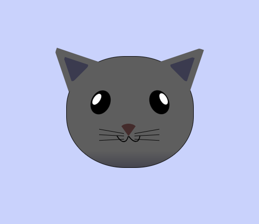
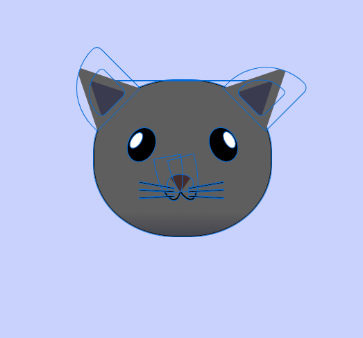

# fCC Cat Painting

This project showcases a simple cat painting using HTML and CSS.

## Preview




## Live Demo

Check out the live demo [here](https://manglam11.github.io/cat_panting/).

## Description

The project consists of an HTML file (`index.html`) and a CSS file (`styles.css`) that renders a cat head illustration using CSS positioning and styling techniques.

## Installation

To view this project locally, follow these steps:

1. Clone the repository:
   ```bash
   git clone https://github.com/Manglam11/cat_panting.git
   ```

## Usage

Feel free to modify and use this project for learning and experimenting with HTML and CSS.

## Credits

This project was created as part of the freeCodeCamp (fCC) curriculum.

## License

This project is open source and available under the [MIT License](https://opensource.org/licenses/MIT).

In this `README.md`:

- `# fCC Cat Painting`: The main title of your project.
- `## Preview`: An image (`./ss_1.png`) showcasing the cat painting.
- `## Live Demo`: A link to the live demo of your project.
- `## Description`: A brief description of your project.
- `## Installation`: Instructions for cloning and running the project locally.
- `## Usage`: Information about how to use and modify the project.
- `## Credits`: Acknowledgment of the project's origin or contributors.
- `## License`: Information about the project's license.
